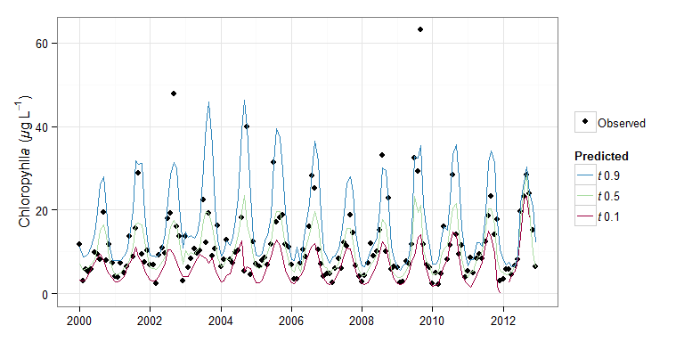
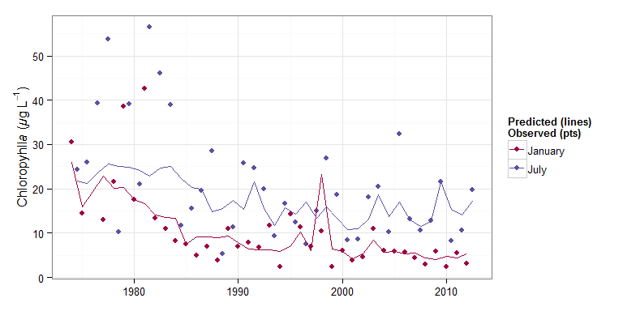
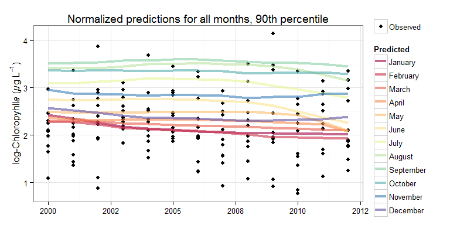

# WRTDStidal: evaluating long-term chlorophyll trends in tidal waters
Marcus W. Beck, beck.marcus@epa.gov, James D. Hagy III, hagy.jim@epa.gov  

[](https://travis-ci.org/fawda123/wtreg_for_estuaries)

This is the development repository for the WRTDStidal package.  Functions within this package can be used to model chlorophyll time series from coastal monitoring data.  The approach follows on previous methods described in the [EGRET](https://github.com/USGS-R/EGRET) package developed by USGS for non-tidal waters.  Details are forthcoming: 

*Beck MW, Hagy JD. In press. Adaptation of a weighted regression approach to evaluate water quality trends in an Estuary. Environmental Modelling and Assessment.*

Please send an email to beck.marcus@epa.gov for the accepted draft.  The original method for streams and rivers is described here:

*Hirsch RM, De Cicco L. 2014. User guide to Exploration and Graphics for RivEr Trends (EGRET) and dataRetrieval: R packages for hydrologic data. Techniques and Methods book 4, ch. A10, US Geological Survey, Reston, Virginia. http://pubs.usgs.gov/tm/04/a10/*

*Hirsch RM, Moyer DL, Archfield SA. 2010. Weighted regressions on time, discharge, and season (WRTDS), with an application to Chesapeake Bay river inputs. Journal of the American Water Resources Association. 46(5):857-880.*

## Brief description of WRTDS for tidal waters

The original WRTDS method was adapted to relate chlorophyll concentration to salinity and time for evaluating trends in long-term water quality time series.  The functional form of the model is a simple regression that relates the natural log of chlorophyll to decimal time and salinity as fraction of freshwater on a sinuisoidal annual time scale (i.e., cyclical variation by year).  Quantile regression models were used to characterize trends for conditional distributions of chlorophyll, e.g., the median or 90<sup>th</sup> percentile. An additional advantage of quantile regression is that bias associated with back-transformation of predicted values in log-space to a linear space does not occur because estimates are equivariant to non-linear, monotonic transformations.  The models also accommodates left-censored data by using a method that builds on the Kaplan-Meier approximation for a single-sample survival function by generalizing to conditional regression quantiles. 

The WRTDS approach obtains fitted values of the response variable by estimating regression parameters for each unique observation.  Specifically, a unique quantile regression model is estimated for each point in the period of observation. Each model is weighted by month, year, and salinity such that a unique set of regression parameters for each observation in the time series is obtained. For example, a weighted regression centered on a unique observation weights other observations in the same year, month, and similar salinity with higher values, whereas observations for different months, years, or salinities receive lower weights.  This weighting approach allows estimation of regression parameters that vary in relation to observed conditions.  Default window widths of six months, 10 years, and half the range of salinity are used.

Predicted values were based on an interpolation matrix from the quantile regression.  A sequence of salinity values based on the minimum and maximum values for the data were used to predict chlorophyll using the observed month and year.  Model predictions are linearly interpolated from the grid using the salinity value closest to the actual for each date. Normalized values are also obtained from the prediction grid that allow an interpretation of chlorophyll trend that is independent of any variation related to salinity changes.  Normalized predictions are obtained for each observation date by assuming that salinity values for the same month in each year were equally likely to occur across the time series.  For example, normalization for January 1<sup>st</sup> 1974 considers all salinity values occuring on January 1<sup>st</sup> for each year in the time series as equally likely to occur on the observed data.  A normalized value for January 1<sup>st</sup> 1974 is the average of the predicted values using each of the salinity values as input, while holding month and year constant.  Normalization across the time series is repeated for each observation to obtain salinity-normalized predictions.    

## Installing the package

The development version of this package can be installed as follows:


```r
install.packages('devtools')
library(devtools)
install_github('fawda123/WRTDStidal')
library(WRTDStidal)
```

## Using the functions

The adapation of WRTDS in tidal waters is designed to predict or normalize chlorophyll concentrations as a function of time, season, and salinity.  The functions have been developed following [S3 documentation](http://adv-r.had.co.nz/OO-essentials.html#s3), with specific methods for `tidal` objects.  The raw data are typically a `data.frame` with rows as monthly observations (ascending time) and four columns as date, chlorophyll, salinity, and lower detection limit for chlorophyll.  The `chldat` dataset that accompanies this package shows the proper format for using the functions.


```r
# import data
data(chldat)

# data format
str(chldat)
```

```
## 'data.frame':	156 obs. of  4 variables:
##  $ date : Date, format: "2000-01-01" "2000-02-01" ...
##  $ chla : num  2.46 1.09 1.78 1.65 1.77 ...
##  $ salff: num  0.192 0.157 0.181 0.166 0.146 ...
##  $ lim  : num  0.875 0.875 0.875 0.875 0.875 ...
```

The `tidfit` dataset is also included in this package to illustrate examples using a fitted model object.  The dataset was created to predict and normalize chlorophyll concentrations for the tenth,  median, and ninetieth conditional quantile distributions.  It can be loaded as follows or recreated from `chldat` using the following code.


```r
# load a fitted model
data(tidfit)

# or recreate from chldat
tidfit <- modfit(chldat, tau = c(0.1, 0.5, 0.9))
```

### Fitting a WRTDS tidal model

The quickest implementation of WRTDS with an input data frame is to use the `modfit` function which is a wrapper for several other functions that complete specific tasks.  Executing the function will create a `tidal` object with multiple attributes and predicted/normalized chlorophyll values.  The following text will also be printed in the console that describes current actions and progress. 


```r
# get wrtds results
res <- modfit(chldat)
```

```
## 
## Estimating interpolation grids for tau = 0.5, % complete...
## 
## 10 	20 	30 	40 	50 	60 	70 	80 	90 	100 	
## 
## Interpolating chlorophyll predictions
## 
## Normalizing chlorophyll predictions
```

The results include the original `data.frame` with additional columns for parameters used to fit the model, model predictions for specified conditional quantiles, and the respective normalized predictions.  The `modfit` function implements four individual functions which can be used separately to create the model. 


```r
# this is equivalent to running modfit
# modfit is a wrapper for tidal, wrtds, chlpred, and chlnorm functions

# pipes from the dplyr (magrittr) package are used for simplicity
library(dplyr)

res <- tidal(chldat) %>%  # creates a tidal object
  wrtds %>% # creates wrtds interpolation grids
  chlpred %>% # get predictions from grids
  chlnorm # get normalized predictions from grids
```

All arguments that apply to each of the four functions in the previous chunk can be passed to the `modfit` function to control parameters used to fit the WRTDS model.  Examples in the help file for `modfit` illustrate some of the more important arguments a user may consider.  These may include changing the conditional quantiles to predict, increasing or decreasing the precision of the salinity values used to create the model interpolation grids, changing the window widths of the weighted regression, or suppressing the output on the console.  


```r
## fit the model and get predicted/normalized chlorophyll data
# default median fit
# grids predicted across salinity range with ten values
res <- modfit(chldat)

## fit different quantiles and smaller interpolation grid
res <- modfit(chldat, tau = c(0.2, 0.8), sal_div = 5)

## fit with different window widths
# half-window widths of one day, five years, and 0.3 salff
res <- modfit(chldat, wins = list(1, 5, 0.3))

## suppress console output
res <- modfit(chldat, trace = FALSE)
```

### Evaluating the results

Several plotting methods are available that can be used to view the results of a fitted model object.  The `fitplot` function is the simplest way to plot the predicted or normalized values of chlorophyll for relevant conditional quantiles.  The default parameters for this function produce a ggplot object with some aesthetics that I chose.  The arguments for this function include options to plot specific quantiles, normalized values, annual aggregations, or to convert values back to log-space. The `pretty` argument can also be used to suppress the default plot aesthetics.  This is useful for producing a `bare-bones' ggplot object that can be further modified.  


```r
# load data from the package for the example
data(tidfit)

# plot using fitplot function

fitplot(tidfit)
```

 

The `sliceplot` function is a modification of `fitplot` that can be used to plot selected time slices from the results.  For example, all results for a particular month across all years can be viewed.  This is useful for evaluating between-year differences in results for constant season.  The `slices` argument is used to specify which months to view.


```r
# plot january, july as defaults
sliceplot(tidfit)
```

 

```r
# a very specific example
sliceplot(tidfit,
 slices = 1:12,
 size = 1.5,
 tau = 0.9,
 alpha = 0.6,
 predicted = FALSE,
 logspace = TRUE
) +
ggplot2::ggtitle('Normalized predictions for all months, 90th percentile')
```

 


